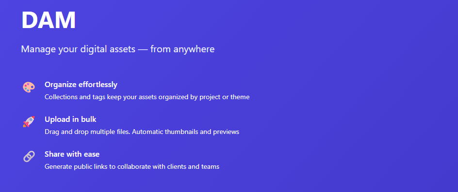

# DAM Platform on AWS EKS



A production-ready Digital Asset Management (DAM) platform that enables teams to upload, organize, share, and export digital assets at scale. Built with a modern full-stack architecture:

- **Frontend:** React 18 single-page app with Vite + Tailwind CSS for a responsive, intuitive user interface
- **Backend:** Node.js Express API with Prisma ORM, providing RESTful endpoints for asset management, authentication, and collaboration
- **Workers:** Async job processors for thumbnail generation (Sharp) and collection exports (ZIP creation)
- **Database:** PostgreSQL 15 on AWS RDS with Multi-AZ failover, KMS encryption, and automated backups
- **Storage:** S3 asset bucket with versioning, intelligent tiering, and pre-signed URLs for direct client uploads
- **Infrastructure:** Amazon EKS 1.35 Kubernetes cluster across 3 availability zones, with auto-scaling node groups and IRSA for secure AWS service access
- **CI/CD:** GitHub Actions pipeline that builds 4 containerized services, pushes images to ECR with timestamps, and auto-deploys to EKS via Helm
- **Infrastructure-as-Code:** Terraform >= 1.10.0 with S3 native state locking, provisioning all AWS resources with safe teardown (force_delete/force_destroy for dev/stg)
- **Security:** End-to-end encryption (KMS), IAM least-privilege roles, JWT authentication (15-min access + 7-day refresh cookies), CORS-enabled S3 uploads, and pod-level network policies

---

## Platform Overview

### Infrastructure
- **Amazon EKS 1.35** — managed Kubernetes control plane with `API_AND_CONFIG_MAP` authentication
- **Multi-AZ VPC** — 3 public + 3 private subnets across `us-east-1a/b/c`
- **Managed Node Group** — Amazon Linux 2023, auto-scaling 1–5 nodes per environment
- **AWS Load Balancer Controller** — Helm-deployed with IRSA, 2 replicas, provisions ALBs from Ingress resources
- **EKS Managed Add-ons** — CoreDNS, kube-proxy, VPC CNI, EBS CSI driver
- **IRSA (IAM Roles for Service Accounts)** — scoped roles for EBS CSI, LBC, DAM API, DAM workers, and CloudWatch agent
- **S3 State Backend** — native lock file (`use_lockfile = true`), no DynamoDB required
- **CloudWatch Log Groups** — all 5 control plane log types + Container Insights, per-environment retention

### DAM Application

**Frontend:**
- `dam/web` — React 18 + Vite + Tailwind CSS single-page app, served by nginx

**Backend:**
- `dam/api` — Node.js + Express REST API with Prisma ORM, connects to PostgreSQL and S3

**Workers:**
- `dam/transform-worker` — generates thumbnails using Sharp (requires libvips)
- `dam/export-worker` — zips collections and uploads to S3

**Data & Deployment:**
- **PostgreSQL 15** on RDS — private, KMS-encrypted, Multi-AZ in prod, accessible only from EKS node security group
- **S3 Asset Bucket** — KMS-encrypted, versioned, TLS-enforced; layout: `originals/`, `thumbnails/`, `exports/`, `temp/`
- **4 ECR Repositories** — one image per service above; KMS-encrypted, lifecycle-managed
- **Helm Chart** — single chart at `helm/dam/` with per-environment values overrides
- **GitHub Actions CI/CD** — builds and pushes all 4 images on every push to `main`, deploys to `dam-dev` namespace automatically
- **KMS Encryption** — single key shared by RDS, S3, and ECR with annual key rotation

---

## Architecture

### Network

- **VPC** — `10.0.0.0/16` across 3 AZs (`us-east-1a/b/c`), 3 private `/19` subnets (nodes, RDS) and 3 public `/24` subnets (NAT gateways, load balancers) (`modules/vpc/main.tf`, `variables.tf`).
- **NAT strategy** — dev/stg share a single NAT gateway (`single_nat_gateway = true`) to save ~$100/month; prod runs one NAT gateway per AZ so an AZ outage doesn't cut off outbound traffic cluster-wide.
- **Ingress** — the DAM app is reachable through an ALB provisioned by the AWS Load Balancer Controller from `helm/dam/templates/ingress.yaml` (paths `/api`, `/health`, `/` routed to `dam-api`/`dam-web`). Grafana is reachable through a separate internet-facing NLB (a plain `LoadBalancer` Service, `monitoring/values.yaml.tpl`).

### Compute

- **EKS 1.35** — one managed node group (AL2023, IRSA enabled, `API_AND_CONFIG_MAP` auth mode), spanning all 3 private subnets (`modules/eks/main.tf`).
- **Namespaces** — `dam-<env>` runs the application (api/web/transform-worker/export-worker); `kube-system` runs cluster add-ons (CoreDNS, kube-proxy, VPC CNI, EBS CSI driver, AWS Load Balancer Controller); `monitoring` runs the observability stack (Prometheus, Grafana, Alertmanager, node-exporter, kube-state-metrics).

### Data layer

- **RDS PostgreSQL 15.18** — `gp3` storage, autoscaling 20Gi→100Gi, KMS-encrypted, private (`dam.tf`).
- **S3 (`dam_assets`)** — versioned, KMS-encrypted, TLS-only bucket policy; `originals/`, `thumbnails/`, `exports/`, `temp/` layout.
- **ECR** — 4 private repositories (one per service), scan-on-push, lifecycle-managed.

### Terraform layout

The root module is split by concern rather than by resource type: `main.tf` (providers, `module.vpc`/`module.eks`), `dam.tf` (KMS/S3/ECR/RDS), `iam.tf` (all IRSA roles), `eks-config.tf` (managed add-ons + Load Balancer Controller), `monitoring.tf` (kube-prometheus-stack + Grafana secret chain), `variables.tf`/`outputs.tf` at the root, and `environments/*.tfvars` + matching `*.backend.hcl` for per-environment overrides and remote state. `bootstrap/` is a separate, one-time-run mini-config that creates the S3 state bucket before the main configuration can use it.

---

## Web Application

The DAM frontend is a single-page application in `app/web/` built with:

| Component | Purpose |
|---|---|
| **React 18** | Component-based UI with hooks |
| **Vite** | Fast development server and production bundler |
| **Tailwind CSS** | Utility-first styling |
| **TanStack Query** | Server-state management — caching, background refetch, optimistic updates |
| **React Router 6** | Client-side routing |
| **Axios** (`src/api/client.ts`) | Typed API layer with automatic JWT refresh interceptor |

**Key pages:** Login, Register, Dashboard (asset grid), CollectionView, ShareView

**Key components:**
- `UploadZone` — drag-and-drop upload using S3 pre-signed URLs (files go directly from the browser to S3, bypassing the API)
- `AssetCard` — thumbnail preview with tag badges and action menu
- `TagFilter` — multi-select tag sidebar for filtering the asset grid
- `Navbar` — authenticated navigation with user context

The web app builds to a static bundle served by nginx (`app/web/nginx.conf`) inside the `dam/web` container.

---

## API (app/api)

Node.js + Express + TypeScript backend with:
- **Prisma ORM** — PostgreSQL schema management and type-safe queries
- **JWT auth** — 15-minute access tokens + 7-day HTTP-only refresh cookies
- **S3 pre-signed URLs** — issued per-request for uploads and downloads
- **Routes** — `/auth`, `/assets`, `/tags`, `/collections`, `/shares`, `/analytics`, `/jobs`

## Workers

| Worker | Image | Role |
|---|---|---|
| `transform-worker` | `dam/transform-worker` | Generates thumbnails using Sharp (requires `libvips`) |
| `export-worker` | `dam/export-worker` | Zips collections and uploads to S3 |

Both workers claim jobs with `SELECT FOR UPDATE SKIP LOCKED` so multiple replicas never process the same job.

---

## Project Structure

```
DevOps-Project2/
├── bootstrap/                      # Run once — creates S3 state bucket and IAM policy
│   ├── main.tf
│   ├── variables.tf
│   └── outputs.tf                  # Prints next steps after apply
├── environments/                   # Per-environment overrides
│   ├── dev.backend.hcl / dev.tfvars
│   ├── stg.backend.hcl / stg.tfvars
│   └── prod.backend.hcl / prod.tfvars
├── modules/
│   ├── eks/                        # EKS cluster + managed node group
│   └── vpc/                        # Multi-AZ VPC
├── app/
│   ├── api/                        # Node.js API (Express + Prisma)
│   ├── web/                        # React 18 + Vite frontend
│   ├── transform-worker/           # Thumbnail generation (Sharp + libvips)
│   ├── export-worker/              # ZIP export worker
│   └── docker-compose.yml          # Local development stack
├── helm/dam/                       # Helm chart for all DAM services
│   ├── Chart.yaml
│   ├── values.yaml                 # Defaults
│   ├── values-dev.yaml
│   ├── values-stg.yaml
│   ├── values-prod.yaml
│   └── templates/                  # Deployments, Services, Ingress, ServiceAccounts, Secret
├── .github/workflows/
│   └── dam-deploy.yml              # Build + push + deploy pipeline
├── versions.tf                     # Terraform providers + S3 backend block
├── variables.tf                    # All input variables + locals
├── main.tf                         # module.vpc + module.eks + provider config
├── iam.tf                          # All IRSA roles (EBS CSI, LBC, DAM API, workers, CloudWatch)
├── dam.tf                          # KMS key, ECR repos, S3 asset bucket, RDS instance
├── eks-config.tf                   # EKS managed add-ons, CloudWatch log groups, LBC Helm release
└── outputs.tf                      # Cluster endpoint, ECR URLs, RDS endpoint, IRSA role ARNs
```

---

## Prerequisites

| Tool | Version | Notes |
|---|---|---|
| Terraform | >= 1.10.0 | Required for S3 native state locking |
| AWS CLI | >= 2.0 | Configured for the target account |
| kubectl | any recent | |
| Helm | >= 3.0 | |
| Docker | >= 24 | For local development and image builds |
| Git | any | |

AWS IAM permissions required: EKS, VPC, IAM, S3, RDS, ECR, KMS, CloudWatch, Secrets Manager.

---

## Setup & Deployment

### Step 1 — Clone the repository

```bash
git clone https://github.com/PetersonOlay/DevOps-Project2.git
cd DevOps-Project2
```

### Step 2 — Bootstrap (first-time only)

Creates the S3 state bucket and least-privilege IAM backend policy. Uses a local backend — run this once and never destroy it.

```bash
cd bootstrap
terraform init
terraform apply -var state_bucket_name=<YOUR_STATE_BUCKET_NAME>
```

After apply, attach the output policy to your IAM user:

```bash
aws iam attach-user-policy \
  --user-name <YOUR_IAM_USER> \
  --policy-arn $(terraform output -raw terraform_s3_backend_policy_arn)
```

### Step 3 — Set the RDS password

Never store this in a `.tfvars` file. Use single quotes to avoid bash history-expansion issues with special characters:

```bash
export TF_VAR_db_password='<your-secure-password>'
```

**Password requirements:**
- Use alphanumeric characters only — avoid `!`, `%`, `@`, `#`, `^`, `&`, `$`
- These characters cause problems in bash, URLs, and shell scripts
- Generate a safe password: `openssl rand -base64 24 | tr -d '/+=' | cut -c1-24`
- Minimum 8 characters, recommended 20+

### Step 4 — Initialise and deploy

Initialise Terraform with the environment-specific backend configuration:

```bash
cd ..
ENV=dev   # dev | stg | prod
terraform init -backend-config=environments/${ENV}.backend.hcl
```

Validate the configuration and preview changes:

```bash
terraform validate
terraform plan -var-file=environments/${ENV}.tfvars
```

On first apply, use targeting to control provider authentication order (the Kubernetes and Helm providers cannot connect until the cluster exists):

```bash
terraform apply -var-file=environments/${ENV}.tfvars -target=module.vpc
terraform apply -var-file=environments/${ENV}.tfvars -target=module.eks
terraform apply -var-file=environments/${ENV}.tfvars
```

> For all subsequent applies (after the cluster already exists) only the third command is needed.
> 
> If `terraform plan` asks for `db_password`, ensure you've set the environment variable: `export TF_VAR_db_password='your-password'`

### Step 5 — Validate RDS and store credentials

After `terraform apply`, validate the RDS connection and immediately store credentials in Secrets Manager before deploying anything to Kubernetes.

**5a — Get the RDS endpoint:**

```bash
ENDPOINT=$(aws rds describe-db-instances \
  --db-instance-identifier dam-${ENV} \
  --region us-east-1 \
  --query 'DBInstances[0].Endpoint.Address' \
  --output text)
echo "RDS Endpoint: $ENDPOINT"
```

**5b — Generate JWT secrets and store everything in Secrets Manager:**

```bash
JWT_SECRET=$(openssl rand -hex 32)
JWT_REFRESH_SECRET=$(openssl rand -hex 32)

aws secretsmanager create-secret \
  --name "dam-${ENV}-app" \
  --region us-east-1 \
  --kms-key-id alias/dam-${ENV} \
  --secret-string "{
    \"db_host\": \"${ENDPOINT}\",
    \"db_username\": \"damadmin\",
    \"db_password\": \"${TF_VAR_db_password}\",
    \"jwt_secret\": \"${JWT_SECRET}\",
    \"jwt_refresh_secret\": \"${JWT_REFRESH_SECRET}\"
  }"
```

**5c — Test database connectivity from an EKS node:**

The RDS security group only allows inbound from EKS nodes. Test the connection before proceeding:

```bash
# Find a node to test from
NODE=$(kubectl get nodes -o jsonpath='{.items[0].metadata.name}')
INSTANCE_ID=$(aws ec2 describe-instances \
  --filters "Name=private-dns-name,Values=${NODE}" \
  --region us-east-1 \
  --query 'Reservations[0].Instances[0].InstanceId' \
  --output text)

# Start an interactive SSM session
aws ssm start-session --target ${INSTANCE_ID} --region us-east-1

# Inside the session, test the connection (psql should be available on AL2023):
psql "postgresql://damadmin:${TF_VAR_db_password}@${ENDPOINT}:5432/dam" -c "SELECT version();"
```

Expected output: `PostgreSQL 15.x...`

If the connection fails, debug and fix it before proceeding to Step 6. Do not deploy to Kubernetes until the `psql` test passes.

### Step 6 — Configure kubectl

```bash
aws eks update-kubeconfig --region us-east-1 --name eks-${ENV}-cluster
# or:
$(terraform output -raw configure_kubectl)
```

### Step 7 — Verify the cluster

```bash
kubectl get nodes -o wide
kubectl get pods -n kube-system
kubectl get deploy -n kube-system aws-load-balancer-controller
```

### Step 8 — Set up GitHub Actions

GitHub Actions needs AWS credentials and the ECR registry URL. Add these secrets and variables:

**Secrets** (Settings → Secrets and variables → Actions → Secrets tab):

1. Click **New repository secret**
2. Name: `AWS_ACCESS_KEY_ID` — Value: `<your IAM access key>`
3. Name: `AWS_SECRET_ACCESS_KEY` — Value: `<your IAM secret key>`

> These credentials should belong to an IAM user with permissions to push to ECR, log in to the cluster, and run `kubectl set image` on deployments.

**Variables** (Settings → Secrets and variables → Actions → Variables tab):

1. Click **New repository variable**
2. Name: `ECR_PREFIX` — Value: `<YOUR_ACCOUNT_ID>.dkr.ecr.us-east-1.amazonaws.com`

> If you need different registries per environment (e.g. separate AWS accounts), add environment-specific variables under **Settings → Environments** instead.

### Step 9 — Deploy the DAM application

**Via CI/CD (automatic):** Push to `main` — the workflow builds all 4 images, pushes to ECR, and rolls out to `dam-dev`.

**Via Helm (manual / first-time):**

```bash
helm upgrade --install dam ./helm/dam \
  -f helm/dam/values-dev.yaml \
  --namespace dam-dev --create-namespace
```

**Promote to staging or production** using `workflow_dispatch` in the GitHub Actions UI, selecting the target environment.

### Step 10 — Verify DAM pods

```bash
kubectl get pods -n dam-dev
kubectl get ingress -n dam-dev
```

### Step 11 — Tear down

The project has multiple layers of infrastructure. Destroy in this order to avoid dependency errors:

#### Step 1 — Set environment variables
```bash
ENV=dev   # change to stg or prod as needed
export TF_VAR_db_password='DAMdev2024!Secure'
```

#### Step 2 — Delete the Kubernetes Ingress (removes the ALB)
```bash
kubectl delete ingress dam-ingress -n dam-${ENV}
```

Verify the ALB is gone (wait 60 seconds, then check):
```bash
aws elbv2 describe-load-balancers \
  --query 'LoadBalancers[?contains(LoadBalancerName, `dam`)]' \
  --output table
```
Proceed only when the table is empty.

#### Step 3 — Uninstall the Helm release
```bash
helm uninstall dam -n dam-${ENV}
```

#### Step 4 — Delete the Kubernetes namespace
```bash
kubectl delete namespace dam-${ENV}
```

#### Step 5 — Delete Secrets Manager secret
```bash
aws secretsmanager delete-secret \
  --secret-id "dam-${ENV}-app" \
  --force-delete-without-recovery \
  --region us-east-1
```

#### Step 6 — Run terraform destroy
```bash
cd ~/DevOps-Project2
terraform init -backend-config=environments/${ENV}.backend.hcl
terraform destroy -var-file=environments/${ENV}.tfvars
```
Type `yes` when prompted. Expected duration: 10–15 minutes.

#### Step 7 (Optional) — Delete the bootstrap S3 bucket
Only if you're permanently shutting down and don't need Terraform state:

```bash
aws s3api delete-objects \
  --bucket dam-bootstrap-395675597879 \
  --delete "$(aws s3api list-object-versions \
    --bucket dam-bootstrap-395675597879 \
    --output json \
    --query '{Objects: Versions[].{Key:Key,VersionId:VersionId}}')"

aws s3 rb s3://dam-bootstrap-395675597879 --force
```

#### Verification after destroy
```bash
# Verify no EKS clusters remain
aws eks list-clusters --region us-east-1

# Verify no RDS instances remain
aws rds describe-db-instances --region us-east-1 \
  --query 'DBInstances[?contains(DBInstanceIdentifier, `dam`)]'

# Verify no ECR repos remain
aws ecr describe-repositories \
  --query 'repositories[?contains(repositoryName, `dam`)]'

# Verify no S3 buckets remain (except bootstrap if keeping state)
aws s3 ls | grep dam
```

**What gets destroyed at each step:**

| Step | Resources removed |
|---|---|
| 2 | AWS Application Load Balancer (ALB) |
| 3 | K8s Deployments, Services, ServiceAccounts, ConfigMaps |
| 4 | K8s namespace |
| 5 | Secrets Manager secret |
| 6 | EKS cluster, node groups, RDS, S3 bucket, ECR repos, VPC, subnets, KMS keys, IAM roles, IRSA roles, security groups (106 resources) |
| 7 | Terraform state bucket (permanent deletion) |

**Notes:**
- The Kubernetes Ingress controller creates an AWS ALB **outside Terraform's state**. Deleting it first prevents VPC/subnet dependency errors.
- ECR repos and S3 bucket have `force_delete: true` and `force_destroy: true` for dev/stg only — allows deletion even if they contain images/objects.
- **Production:** ECR repos and S3 bucket in prod have `force_delete: false` and `force_destroy: false` to prevent accidental data loss.
- The bootstrap S3 bucket has `prevent_destroy = true` — must be deleted manually if permanently shutting down.

---

## CI/CD Pipeline

The workflow at `.github/workflows/dam-deploy.yml` runs in two jobs:

**build-and-push** (matrix across all 4 services):
1. Authenticates to AWS using `AWS_ACCESS_KEY_ID` / `AWS_SECRET_ACCESS_KEY`
2. Logs in to ECR
3. Builds each Docker image with `--cache-from` for layer reuse
4. Pushes `sha-<git-sha>` and `latest` tags

**deploy** (after all builds pass):
1. Authenticates to AWS
2. Updates kubeconfig for `eks-<env>-cluster`
3. Runs `kubectl set image` for all 4 deployments in `dam-<env>` namespace
4. Waits for rollouts to complete (300s timeout per deployment)
5. Prints pod and ingress status

**Triggers:**
- `push` to `main` with changes in `app/**` or `helm/**` → always targets `dev`
- `workflow_dispatch` → choose `dev`, `stg`, or `prod` manually

---

## Environments

| | dev | stg | prod |
|---|---|---|---|
| EKS nodes | t3.medium × 1–4 | m5.large × 2–4 | m5.large × 2–5 |
| NAT Gateways | 1 shared | 1 shared | 3 (one per AZ) |
| RDS instance | db.t3.micro | db.t3.medium | db.t3.medium |
| RDS Multi-AZ | No | No | Yes |
| RDS backup retention | 1 day | 1 day | 7 days |
| Log retention | 7 days | 30 days | 90 days |
| K8s namespace | `dam-dev` | `dam-stg` | `dam-prod` |

---

## Security

**Encryption at rest** — a single KMS key (`aws_kms_key.dam`) encrypts RDS, S3, and ECR, with annual rotation.

**IRSA roles** (`iam.tf`) — each pod-facing AWS permission is scoped to a specific namespace:service-account pair, not the node's instance role:

| Role | Service account | Grants |
|---|---|---|
| `ebs_csi_irsa` | `kube-system:ebs-csi-controller-sa` | `AmazonEBSCSIDriverPolicy` |
| `lbc_irsa` | `kube-system:aws-load-balancer-controller` | `AWSLoadBalancerControllerIAMPolicy` |
| `cloudwatch_irsa` | `amazon-cloudwatch:cloudwatch-agent` | `CloudWatchAgentServerPolicy` |
| `dam_api` | `dam:dam-api` | S3 read/write/delete on `dam_assets`, KMS, Secrets Manager (`dam-<env>-*`) |
| `dam_worker` | `dam:dam-transform-worker`, `dam:dam-export-worker` | S3 read/write (no delete), KMS, Secrets Manager |

`dam_api`/`dam_worker`'s S3 policies are least-privilege — scoped to the exact bucket ARN and a narrow action list, not `s3:*`.

> **Known issue:** `iam.tf`'s `dam_api`/`dam_worker` trust policies hardcode the service-account namespace as `dam` (`system:serviceaccount:dam:dam-api`), but the application actually deploys to `dam-<env>` (e.g. `dam-dev`, per `helm/dam/values-dev.yaml`). This mismatch means the IRSA trust condition doesn't match the real service account, so token exchange for these two roles likely fails as currently written. Not fixed here — flagging for a follow-up.

**Network isolation** — the RDS security group only allows inbound `5432` from the EKS node security group; there is no `0.0.0.0/0` ingress rule anywhere near the database.

**Node access** — nodes are reachable only via SSM Session Manager (`AmazonSSMManagedInstanceCore`); there is no SSH key pair or bastion host in this repo.

**Secrets handling** — three independent chains, none of which put a plaintext secret in git or tfvars:
- `db_password` — supplied only via `TF_VAR_db_password`, `sensitive = true`, no default.
- `dam-<env>-app` — created out-of-band in Secrets Manager (db + JWT credentials), read by the deploy workflow and materialized into the `dam-secrets` Kubernetes Secret at deploy time.
- `dam-<env>-grafana` — fully Terraform-owned: `random_password.grafana_admin` → `aws_secretsmanager_secret` → mirrored into a Kubernetes Secret, consumed by the Helm chart via `grafana.admin.existingSecret`.

> **Tradeoff, by design:** Grafana is exposed on an internet-facing NLB, protected only by that admin password — no IP allowlist, SSO, or WAF. This mirrors the DAM app's own ALB, which also has no WAF association and an optional (default-empty) ACM certificate. Both public entry points currently rely on application-level auth rather than network-level restriction. Worth revisiting if either service holds more sensitive data over time.

---

## Availability & Resilience

**Multi-AZ by default** — all three environments span 3 AZs for subnets and the EKS node group. RDS Multi-AZ is prod-only (`db_multi_az`); dev/stg accept single-AZ RDS to save cost. NAT gateways follow the same pattern: one shared gateway for dev/stg, one per AZ in prod.

**Node group scaling** — sizing is set per environment in `environments/*.tfvars` (dev 1–4, stg 2–4, prod 2–5 nodes). One important caveat discovered operating this cluster: the `terraform-aws-modules/eks` module ignores changes to `desired_size` after the node group's initial creation (by design, so Terraform doesn't fight the Cluster Autoscaler) — only `min_size`/`max_size` changes actually apply on a later `terraform apply`. To rescale the *desired* count on an existing node group, use the AWS CLI directly:
```bash
aws eks update-nodegroup-config --cluster-name <cluster> --nodegroup-name <ng> \
  --region us-east-1 --scaling-config minSize=<min>,maxSize=<max>,desiredSize=<desired>
```

**Pod-level resilience** — replica counts scale per environment (api/web 1–3 replicas, workers 1–2). `dam-api` and `dam-web` both have readiness and liveness probes against `/health`; `transform-worker` and `export-worker` currently have **no probes at all** — a real gap worth closing, since Kubernetes has no way to detect a wedged worker pod today.

**RDS resilience** — 7-day backup retention in prod (1 day in dev/stg), storage autoscaling up to 100Gi so growth doesn't hit a hard ceiling unexpectedly.

**Monitoring stack resilience** — intentionally asymmetric by environment: dev runs a single Grafana replica with Alertmanager disabled (cost-optimized, no on-call in dev); prod runs 2 Grafana replicas with Alertmanager enabled.

**Capacity gotcha** — on a `t3.medium` node, the hard pod-count ceiling (~17 pods, ENI-limited) is reached well before CPU or memory pressure shows up. This bit us directly when adding the monitoring stack to the dev node group — `kubectl describe node` showed only ~70% CPU / ~46% memory requested, but new pods still failed to schedule with "Too many pods." Worth remembering when sizing dev nodes for anything beyond the current workload.

---

## Deployment Strategy

**Promotion model** — a push to `main` always deploys to `dev` only (`ENVIRONMENT: ${{ github.event.inputs.environment || 'dev' }}` in `dam-deploy.yml`). Promoting to `stg` or `prod` requires manually running the workflow via `workflow_dispatch` with an explicit environment selection — there is no automatic promotion path.

**Image tagging** — every build gets a shared `sha-<full-sha>-<env>-<timestamp>` tag (computed once in a `prepare` job and passed to both the build matrix and the deploy job via job outputs) plus a rolling `latest` tag. This was a real bug fixed this session: the tag used to be computed independently inside each matrix job via `$GITHUB_ENV`, which doesn't propagate across jobs — the deploy step was silently getting an empty tag.

**Helm strategy** — deploys use idempotent `helm upgrade --install`. The target namespace is labeled/annotated with Helm ownership metadata *before* the install step, avoiding the "namespace exists and cannot be imported" error on redeploys. IRSA role ARNs are fetched live via `aws iam get-role` and injected with `--set` at deploy time rather than being baked into the values files (which ship with empty `irsaRoleArn: ""` defaults).

**Rollout verification** — the workflow waits on `kubectl rollout status --timeout=300s` for each of the 4 deployments before declaring success, then runs a final `kubectl get pods` / `get ingress` health check.

**Terraform apply ordering** — a brand-new environment needs a staged apply: `-target=module.vpc`, then `-target=module.eks`, then a full apply — because the `kubernetes`/`helm` providers can't authenticate until the cluster exists (documented in `main.tf`). The monitoring stack added a second staging requirement: `kubernetes_manifest` resources (like the DAM API `ServiceMonitor`) validate their CRD's schema live against the API server *at plan time*, so they can't be planned in the same run that installs the CRD providing that type. In practice: apply the Helm release that installs the CRDs first, then apply again for anything that depends on them.

---

## Troubleshooting

### Kubernetes/Helm provider fails on first apply

```
Error: Get "https://<endpoint>/api": context deadline exceeded
```

**Fix:** Use the three-pass apply from Step 4 — target `module.vpc` first, then `module.eks`, then run the full apply.

---

### Backend bucket does not exist on terraform init

```
Error: Failed to get existing workspaces: S3 bucket does not exist.
```

**Fix:** Complete the bootstrap step first, then re-run `terraform init`.

---

### Terraform plan fails: "Unsupported argument: most_recent"

```
Error: Unsupported argument
  on eks-config.tf line 9, in resource "aws_eks_addon" "coredns":
    most_recent = true
An argument named "most_recent" is not expected here.
```

**Fix:** The `aws_eks_addon` resource does not support `most_recent`. Each addon will automatically use the default/recommended version for the cluster's Kubernetes version. This is already fixed in the current code — ensure you're running the latest version from the repository.

---

### Terraform plan/apply fails: "Cannot find version 15.7 for postgres"

```
Error: creating RDS DB Instance (dam-dev): operation error RDS: CreateDBInstance,
api error InvalidParameterCombination: Cannot find version 15.7 for postgres
```

**Cause:** PostgreSQL 15.7 is not available in the target region (us-east-1). AWS RDS minor versions vary by region and are retired over time.

**Fix:** Find the latest available PostgreSQL 15.x version:
```bash
aws rds describe-db-engine-versions --engine postgres --engine-version 15 \
  --region us-east-1 --query 'DBEngineVersions[*].EngineVersion' --output text
```

Use the latest version found (e.g., 15.18). This is already fixed in the current code — ensure you're running the latest version from the repository.

---

### Terraform plan/apply fails: "The specified log group already exists"

```
Error: creating CloudWatch Logs Log Group (/aws/eks/eks-dev-cluster/cluster):
ResourceAlreadyExistsException: The specified log group already exists
```

**Cause:** EKS automatically creates CloudWatch log groups for cluster and Container Insights logs before Terraform tries to create them.

**Fix:** This is already fixed in the current code — Terraform no longer attempts to manage these log groups. EKS owns their creation, and you can manage retention via AWS CLI if needed:
```bash
aws logs put-retention-policy --log-group-name /aws/eks/eks-dev-cluster/cluster \
  --retention-in-days 7
```

---

### Pods stuck in ImagePullBackOff

```
Failed to pull image "...dkr.ecr...": no basic auth credentials
```

**Fix:** The node IAM role requires `AmazonEC2ContainerRegistryReadOnly`. This is already added in `modules/eks/main.tf` under `iam_role_additional_policies`. If you see this on an existing cluster, you may need to re-apply after adding the policy.

---

### API pods cannot connect to RDS

```
Error: connect ECONNREFUSED <rds-endpoint>:5432
```

**Fix:** The RDS security group only allows port 5432 from the EKS node security group. Verify `aws_security_group.rds` in `dam.tf` references `module.eks.node_security_group_id`. Also confirm `DATABASE_URL` in the `dam-secrets` Kubernetes secret is set correctly.

---

### Nodes show NotReady after apply

**Fix:** Node bootstrap takes 3–5 minutes after the node group is created. Wait and recheck. If still NotReady after 10 minutes, check node group events in the EKS console.

---

### GitHub Actions deploy job fails: "Input required and not supplied: aws-region"

```
Error: Input required and not supplied: aws-region
```

**Cause:** The `AWS_REGION` environment variable is referenced in the workflow but not defined in the `env:` block.

**Fix:** This is already fixed in the current code — `AWS_REGION: us-east-1` is set at the top of the workflow. Ensure you're running the latest version from the repository.

---

### Docker build fails: "npm ci can only install with existing package-lock.json"

```
npm error The `npm ci` command can only install with an existing package-lock.json
```

**Cause:** The `npm ci` (clean install) command requires `package-lock.json`, but the service directory doesn't have one.

**Fix:** Generate lock files locally for all services:
```bash
cd app/api && npm install && cd ../..
cd app/web && npm install && cd ../..
cd app/transform-worker && npm install && cd ../..
cd app/export-worker && npm install && cd ../..
git add app/*/package-lock.json && git commit -m "Add package-lock.json files"
git push origin main
```

This is already fixed in the current repository with committed lock files.

---

### Docker build fails: "This line is invalid. It does not start with any known Prisma schema keyword"

```
Error validating: This line is invalid...
  --> prisma/schema.prisma:128
    | enum Role { ADMIN MEMBER VIEWER }
```

**Cause:** Prisma enums require each value on its own line; single-line enum syntax is invalid.

**Fix:** Reformat enums to multi-line:
```prisma
enum Role {
  ADMIN
  MEMBER
  VIEWER
}
```

This is already fixed in the current code for all services (api, transform-worker, export-worker).

---

### Helm deployment fails: "Namespace exists and cannot be imported into the current release"

```
Error: Unable to continue with install: Namespace "dam-dev" in namespace "" exists and cannot be imported
...invalid ownership metadata; label validation error: missing key "app.kubernetes.io/managed-by"
annotation validation error: missing key "meta.helm.sh/release-name"
```

**Cause:** The namespace exists (created in prior run) but lacks Helm ownership metadata. Helm refuses to adopt any namespace it doesn't own, even with `--create-namespace`.

**Fix:** This is already fixed in the current code. The workflow now includes a "Prepare namespace for Helm" step that patches the namespace with required metadata:
```bash
kubectl label namespace "${NAMESPACE}" \
  app.kubernetes.io/managed-by=Helm --overwrite
kubectl annotate namespace "${NAMESPACE}" \
  meta.helm.sh/release-name=dam \
  meta.helm.sh/release-namespace="${NAMESPACE}" --overwrite
```

This is idempotent — safe for fresh clusters (no namespace yet) and pre-existing namespaces created without Helm metadata.

---

### Kubernetes deployment fails: "deployments 'dam-api' not found"

```
Error from server (NotFound): deployments.apps "dam-api" not found
```

**Cause:** The workflow tries to update image tags on deployments that don't exist yet (first deployment).

**Fix:** This is already fixed — the workflow now runs `helm upgrade --install` before updating image tags, ensuring all 4 deployments exist before the workflow tries to update them.

---

### Common RDS mistakes (and how to avoid them)

**Mistake 1 — Wrong username in DATABASE_URL**

```
P1000: Authentication failed... the provided database credentials for `postgres` are not valid.
```

The RDS master user is `damadmin` (not `postgres`). Always check `variables.tf:117` for the actual username before writing the connection string. The correct format is:
```
postgresql://damadmin:<password>@<endpoint>:5432/dam
```

**Mistake 2 — Password with shell-hostile characters**

Passwords containing `!`, `%`, `@`, `#`, `^`, `&`, or `$` fail silently in bash, especially if you use `export TF_VAR_db_password=` (without quotes). Always:
- Use single quotes: `export TF_VAR_db_password='...'`
- Or generate a safe password: `openssl rand -base64 24 | tr -d '/+=' | cut -c1-24`
- Only use alphanumeric characters in passwords

**Mistake 3 — Skipping Secrets Manager storage**

If you forget to store credentials in Secrets Manager immediately after `terraform apply`, you'll have no record of the password later (especially if Terraform state is lost). Always run Step 5 before anything else.

**Mistake 4 — No connectivity test before deploying**

Don't skip the `psql` test in Step 5c. Authentication errors will only surface when pods start crashing inside Kubernetes, making debugging harder. Test locally first.

---

### Grafana/Prometheus PVCs stuck Pending: "no persistent volumes available"

```
Warning  FailedBinding  persistentvolumeclaim/kube-prometheus-stack-grafana
no persistent volumes available for this claim and no storage class is set
```

**Cause:** the EKS `aws-ebs-csi-driver` managed add-on creates a `gp2` StorageClass but does not mark it as the cluster default, so PVCs with no `storageClassName` never bind.

**Fix:** set `storageClassName: gp2` explicitly wherever kube-prometheus-stack creates a PVC — `grafana.persistence.storageClassName` and `prometheus.prometheusSpec.storageSpec.volumeClaimTemplate.spec.storageClassName` in `monitoring/values.yaml.tpl`. This is already fixed in the current code.

---

### Prometheus PVC still Pending after fixing the StorageClass

**Cause:** a PVC created during a *failed* first Helm install isn't recreated when the underlying `volumeClaimTemplate` changes — StatefulSets only create a PVC if one matching the name doesn't already exist, so the stale, storage-class-less PVC just sits there forever.

**Fix:** delete the stuck PVC (safe if it was never `Bound` — no data to lose) and its pod, so the StatefulSet recreates both from the corrected template:
```bash
kubectl delete pvc -n monitoring prometheus-kube-prometheus-stack-prometheus-db-prometheus-kube-prometheus-stack-prometheus-0
kubectl delete pod -n monitoring prometheus-kube-prometheus-stack-prometheus-0
```

---

### `terraform apply` doesn't add nodes even though `node_group_desired_size` was raised

**Cause:** the `terraform-aws-modules/eks` module ignores changes to `desired_size` after the node group's initial creation — this is intentional, so Terraform doesn't repeatedly fight the Cluster Autoscaler over the current node count. Only `min_size`/`max_size` changes take effect on subsequent applies.

**Fix:** rescale the running node group directly:
```bash
aws eks update-nodegroup-config --cluster-name <cluster> --nodegroup-name <ng> \
  --region us-east-1 --scaling-config minSize=<min>,maxSize=<max>,desiredSize=<desired>
```

---

### `kubernetes_manifest` ServiceMonitor fails: "API did not recognize GroupVersionKind"

```
Error: API did not recognize GroupVersionKind from manifest (CRD may not be installed)
no matches for kind "ServiceMonitor" in group "monitoring.coreos.com"
```

**Cause:** `kubernetes_manifest` validates a resource's schema live against the API server at *plan* time, before anything is applied — so it can't be planned in the same run that installs the CRD providing that type (here, the Prometheus Operator's `ServiceMonitor` CRD, installed by the `kube_prometheus_stack` Helm release).

**Fix:** apply in two passes — everything except the ServiceMonitor first (e.g. via `-target`), then a second `terraform apply` once the CRD exists.

---

### ServiceMonitor exists but Prometheus never scrapes the target

**Cause:** a ServiceMonitor's `spec.selector.matchLabels` matches against the **Service's own metadata labels**, not its pod `selector`. A Service can have `spec.selector: {app: dam-api}` (for routing traffic to pods) while having no `app: dam-api` label on itself — in which case the ServiceMonitor matches nothing, and the target silently never appears in Prometheus.

**Fix:** add `metadata.labels` to the Service, not just `spec.selector`:
```yaml
metadata:
  name: dam-api
  labels:
    app: dam-api   # <- required for ServiceMonitor selection
spec:
  selector:
    app: dam-api    # <- required for pod routing (separate concern)
```
This is already fixed in `helm/dam/templates/service-api.yaml`.

---

### Target found but scraped as 404, or dropped for a port mismatch

**Cause:** the ServiceMonitor references its scrape port by name (`port: http`), but the Service's port had no `name:` field, so nothing matched.

**Fix:** name the port consistently on both sides:
```yaml
ports:
  - name: http
    port: 3000
    targetPort: 3000
```
Separately: if the target becomes `UP` but scrapes return `404`, the running pod predates the `/metrics` endpoint being added to the app code — this isn't a config bug, just wait for the next deploy to roll out the instrumented image.

---

### Grafana LoadBalancer URL unreachable right after `terraform apply`

**Cause:** AWS NLB DNS and target-group registration take a few minutes to propagate after the load balancer is first created — this is normal, async AWS provisioning, not a misconfiguration.

**Fix:** retry after 2–5 minutes. `curl -I http://<grafana-lb-hostname>/login` should return `200` once it's ready; `kubectl get svc -n monitoring kube-prometheus-stack-grafana` shows the hostname in the meantime.

---

### CI Docker build fails `npm ci` lockfile-sync error after adding a new dependency

```
npm error `npm ci` can only install packages when your package.json and
package-lock.json or npm-shrinkwrap.json are in sync
```

**Cause:** this is a variant of the "npm ci can only install with existing package-lock.json" issue above — but triggered by *editing* `package.json` (e.g. adding `prom-client`) without regenerating the lockfile, rather than a missing lockfile entirely. `npm ci` fails on any drift between the two files, not just a missing one.

**Fix:** always run `npm install` locally immediately after any `package.json` edit, and commit the regenerated `package-lock.json` before pushing:
```bash
cd app/api && npm install && cd ../..
git add app/api/package-lock.json && git commit -m "Update lockfile" && git push
```

---

## Project Highlights

**Infrastructure & Security:**
- **No DynamoDB** — S3 native state locking (`use_lockfile = true`) requires only Terraform >= 1.10 and bucket versioning
- **Direct browser uploads** — S3 pre-signed URLs bypass the API for large files, reducing API load and cost
- **No double-processing** — workers claim jobs with `SELECT FOR UPDATE SKIP LOCKED`; multiple replicas are safe
- **KMS encryption end-to-end** — single key covers RDS storage, S3 objects, and ECR image layers, with annual rotation
- **Environment isolation** — dev, stg, and prod use separate state files, namespaces, and RDS instances from one codebase
- **SSM Session Manager** — shell access to nodes without SSH keys or a bastion host
- **AL2023 nodes** — recommended AMI for EKS 1.35+

**CI/CD & Deployment:**
- **Parallel matrix builds** — all 4 Docker images build simultaneously; total pipeline time equals the slowest single build, not the sum
- **Docker layer caching** — `--cache-from latest` reuses unchanged layers; only modified code layers are rebuilt
- **Immutable image tags** — every image is tagged `sha-<git-sha>` (tied to exact commit) and `latest` (rolling); enables precise rollbacks
- **Path-scoped triggers** — CI only fires when `app/**` or `helm/**` changes; Terraform-only commits skip the pipeline
- **Automatic dev / manual promotion** — push to `main` always deploys to dev; stg and prod require an explicit `workflow_dispatch` approval
- **Rollout health gate** — pipeline waits for `kubectl rollout status` (300 s timeout) before marking success; unhealthy deploys fail the build

---

## Resources

- [Terraform AWS EKS Module](https://registry.terraform.io/modules/terraform-aws-modules/eks/aws/latest)
- [Terraform AWS VPC Module](https://registry.terraform.io/modules/terraform-aws-modules/vpc/aws/latest)
- [AWS EKS Documentation](https://docs.aws.amazon.com/eks/latest/userguide/what-is-eks.html)
- [AWS Load Balancer Controller](https://kubernetes-sigs.github.io/aws-load-balancer-controller/)
- [Terraform S3 Backend](https://developer.hashicorp.com/terraform/language/backend/s3)
- [IAM Roles for Service Accounts](https://docs.aws.amazon.com/eks/latest/userguide/iam-roles-for-service-accounts.html)
- [Sharp image processing](https://sharp.pixelplumbing.com/)

---

## Contributing

Open a pull request at [github.com/PetersonOlay/DevOps-Project2](https://github.com/PetersonOlay/DevOps-Project2) with a clear description of what changed and why.

---

## Author

Built by **[Peterson Olay](https://github.com/PetersonOlay)**

- GitHub: [github.com/PetersonOlay](https://github.com/PetersonOlay)
- LinkedIn: [linkedin.com/in/peter-olay-745b05292](https://www.linkedin.com/in/peter-olay-745b05292/)
- Website: [peterolay.previselab.com](https://peterolay.previselab.com)
